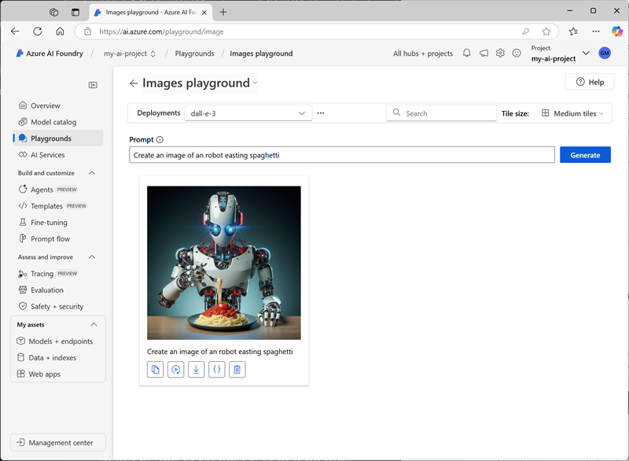
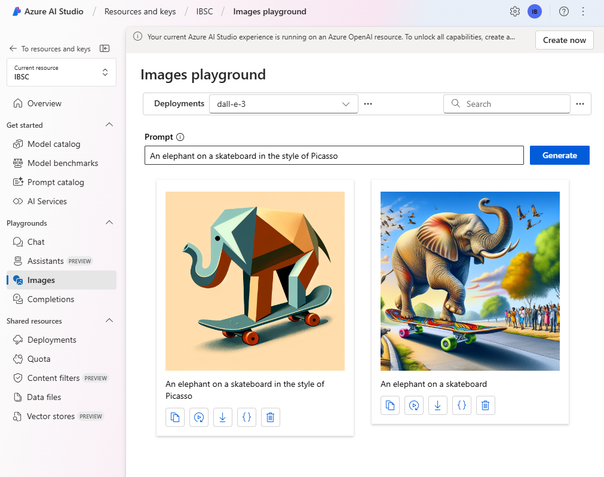

---
lab:
  title: Membuat gambar dengan model DALL-E
---

# Membuat gambar dengan model DALL-E

Azure OpenAI Service berisi model pembuatan gambar bernama DALL-E. Anda dapat menggunakan model ini untuk mengirimkan perintah bahasa alami yang menjelaskan gambar yang diinginkan, lalu model tersebut akan menghasilkan gambar asli berdasarkan deskripsi yang Anda berikan.

Dalam latihan ini, Anda akan menggunakan model DALL-E versi 3 untuk menghasilkan gambar berdasarkan perintah bahasa alami.

Latihan ini akan memakan waktu sekitar **25** menit.

## Provisi sumber daya Azure OpenAI

Sebelum dapat menggunakan Azure OpenAI, Anda harus memprovisikan sumber daya Azure OpenAI di langganan Azure Anda. Sumber daya harus berada di wilayah yang mendukung DALL-E.

1. Masuk ke **portal Microsoft Azure** di `https://portal.azure.com`.
1. Buat sumber daya **Azure OpenAI** dengan pengaturan berikut:
    - **Subscription**: *Pilih langganan Azure yang telah disetujui untuk akses ke Azure OpenAI Service, termasuk DALL-E*
    - **Grup sumber daya**: *Memilih atau membuat grup sumber daya*
    - **Wilayah**: *Pilih **US Timur** atau **Swedia Tengah***\*
    - **Nama**: *Nama unik pilihan Anda*
    - **Tingkat harga**: Standar S0

    > \* model DALL-E 3 hanya tersedia di sumber daya Azure OpenAI Service di wilayah **US Timur** dan **Swedia Tengah**.

1. Tunggu hingga penerapan selesai. Kemudian buka sumber daya Azure OpenAI yang disebarkan di portal Microsoft Azure.
1. Pada halaman **Ikhtisar** untuk sumber daya Azure OpenAI Anda, gulir ke bawah ke bagian **Memulai** lalu pilih tombol untuk masuk ke **portal AI Foundry** (sebelumnya AI Studio).
1. Di portal Azure AI Foundry, di panel sebelah kiri, pilih halaman **Penyebaran** dan lihat penyebaran model yang sudah ada. Jika Anda belum memilikinya untuk DALL-E 3, buat penyebaran baru model **dall-e-3** dengan pengaturan berikut:
    - **Nama penyebaran**: dalle3
    - **Versi model**: *Gunakan versi default*
    - **Tipe penyebaran**: Standar
    - **Unit kapasitas**: 1K
    - **Filter konten**: Default
    - **Aktifkan kuota dinamis**: Dinonaktifkan
1. Satu disebarkan, navigasikan kembali ke halaman **Gambar** di panel kiri.

## Menjelajahi pembuatan gambar di playground gambar

Anda dapat menggunakan playground Gambar di **portal Azure AI Foundry** untuk bereksperimen dengan pembuatan gambar.

1. Di bagian **Playground gambar**, penyebaran DALL-E 3 Anda harus dipilih secara otomatis. Jika tidak, pilih dari menu dropdown penyebaran.
1. Dalam kotak **Perintah**, masukkan deskripsi gambar yang ingin Anda hasilkan. Misalnya, `An elephant on a skateboard`. Kemudian, pilih **Hasilkan** dan lihat gambar yang dihasilkan.

    

1. Ubah perintah untuk memberikan deskripsi yang lebih spesifik. Contoh: `An elephant on a skateboard in the style of Picasso`. Kemudian, hasilkan gambar baru dan tinjau hasilnya.

    

## Menggunakan REST API untuk menghasilkan gambar

Azure OpenAI Service menyediakan REST API yang dapat Anda gunakan untuk mengirimkan perintah pembuatan konten - termasuk gambar yang dihasilkan oleh model DALL-E.

### Bersiap untuk mengembangkan aplikasi di Visual Studio Code

Sekarang mari kita jelajahi bagaimana Anda dapat membuat aplikasi kustom yang menggunakan Azure OpenAI Service untuk menghasilkan gambar. Anda akan mengembangkan aplikasi menggunakan Visual Studio Code. File kode untuk aplikasi Anda telah disediakan di repositori GitHub.

> **Tips**: Jika Anda telah membuat klon repositori **mslearn-openai**, buka klon tersebut di Visual Studio Code. Atau, ikuti langkah-langkah ini untuk mengkloningnya ke lingkungan pengembangan Anda.

1. Memulai Visual Studio Code.
2. Buka palet (SHIFT+CTRL+P) dan jalankan **Git: Perintah klon** untuk mengkloning repositori `https://github.com/MicrosoftLearning/mslearn-openai` ke folder lokal (tidak masalah folder mana).
3. Setelah repositori dikloning, buka folder di Visual Studio Code.

    > **Catatan**: Jika Visual Studio Code menampilkan pesan pop-up yang meminta Anda memercayai kode yang Anda buka, klik opsi **Ya, saya memercayai pembuatnya** di pop-up.

4. Tunggu sementara file tambahan diinstal untuk mendukung proyek kode C# di repositori.

    > **Catatan**: Jika Anda diminta untuk menambahkan aset yang diperlukan guna membangun dan men-debug, pilih **Tidak Sekarang**.

### Mengonfigurasi aplikasi Anda

Aplikasi untuk C# dan Python telah disediakan. Kedua aplikasi memiliki fungsionalitas yang sama. Pertama, Anda harus menambahkan titik akhir dan kunci untuk sumber daya Azure OpenAI ke file konfigurasi aplikasi.

1. Di Visual Studio Code, pada panel **Penjelajah**, telusuri folder **Labfiles/05-image-generation** dan luaskan folder **CSharp** atau **Python** tergantung pada preferensi bahasa Anda. Setiap folder berisi file khusus bahasa untuk aplikasi yang akan Anda integrasikan dengan fungsionalitas Azure OpenAI.
2. Pada panel **Penjelajah**, di folder **CSharp** atau **Python**, buka file konfigurasi untuk bahasa antarmuka pilihan pengguna

    - **C#**: appsettings.json
    - **Python**: .env
    
3. Perbarui nilai konfigurasi untuk menyertakan **titik akhir** dan **kunci** dari sumber daya Azure OpenAI yang Anda buat (tersedia di halaman **Kunci dan Titik Akhir** untuk sumber daya Azure OpenAI di portal Microsoft Azure).
4. Simpan file konfigurasi.

### Melihat kode aplikasi

Sekarang Anda siap untuk menjelajahi kode yang digunakan untuk memanggil REST API dan menghasilkan gambar.

1. Pada panel **Penjelajah**, pilih file kode utama untuk aplikasi Anda:

    - C#: `Program.cs`
    - Python: `generate-image.py`

2. Tinjau kode yang ada dalam file dengan memperhatikan fitur utama berikut:
    - Kode membuat permintaan https ke titik akhir untuk layanan Anda, termasuk kunci untuk layanan Anda di header. Kedua nilai ini diperoleh dari file konfigurasi.
    - Permintaan mencakup beberapa parameter, termasuk perintah yang menjadi dasar pembuatan gambar, jumlah gambar yang akan dihasilkan, dan ukuran gambar yang dihasilkan.
    - Respons mencakup perintah yang direvisi dari hasil ekstrapolasi model DALL-E terhadap perintah yang disediakan pengguna untuk membuatnya lebih deskriptif, serta URL untuk gambar yang dihasilkan.
    
    > **Penting**: Jika Anda menamai penyebaran apa pun selain * dalle3* yang direkomendasikan, Anda harus memperbarui kode untuk menggunakan nama penyebaran Anda.

### Menjalankan aplikasi

Setelah Anda meninjau kode, sekarang saatnya untuk menjalankannya dan menghasilkan beberapa gambar.

1. Klik kanan folder **CSharp** atau **Python** yang berisi file kode Anda dan buka terminal terintegrasi. Kemudian, masukkan perintah berikut untuk menjalankan aplikasi:

   **C#**
   ```
   dotnet run
   ```
   
   **Python**
   ```
   pip install requests
   python generate-image.py
   ```

3. Saat diminta, masukkan deskripsi untuk gambar. Misalnya, *Jerapah yang menerbangkan layang-layang*.

4. Tunggu hingga gambar dibuat - hyperlink akan ditampilkan di panel terminal. Setelah itu, pilih hyperlink untuk membuka tab browser baru dan tinjau gambar yang dihasilkan.

   > **TIP**: Jika aplikasi tidak mengembalikan respons, tunggu beberapa saat dan coba lagi. Sumber daya yang baru disebarkan akan tersedia paling lama setelah 5 menit.

5. Tutup tab browser yang berisi gambar yang dihasilkan dan jalankan kembali aplikasi untuk menghasilkan gambar baru dengan perintah yang berbeda.

## Penghapusan

Setelah selesai dengan sumber daya Azure OpenAI Anda, ingatlah untuk menghapus sumber daya tersebut pada **portal Microsoft Azure** di `https://portal.azure.com`.
